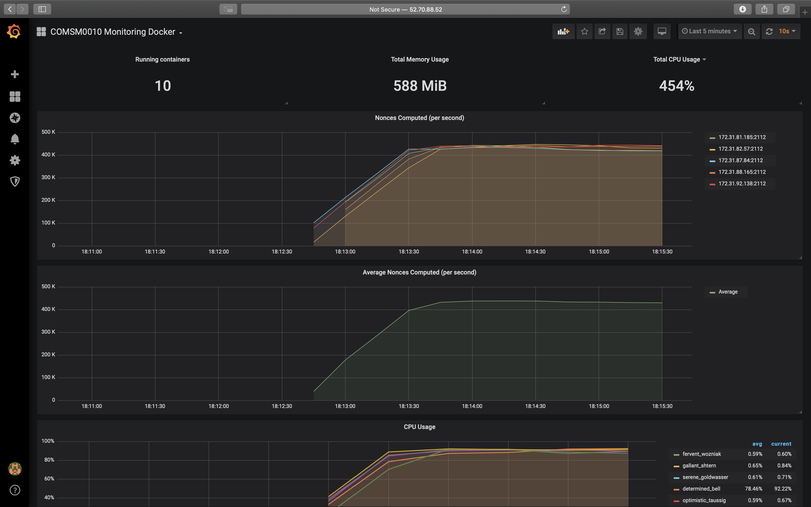
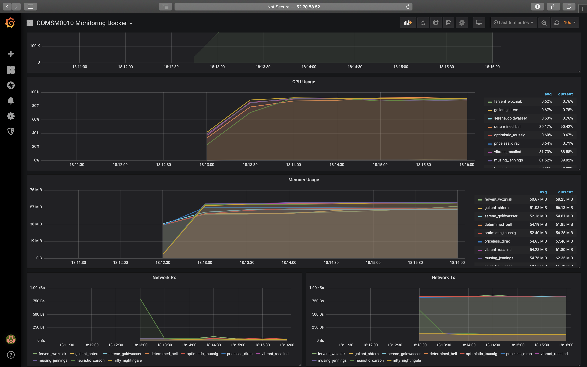

# PoW: Blockchain Proof-of-Work in the Cloud


This project was created for the COMSM0010 Cloud Computing Assignment: Horizontal Scaling.
It demonstrates how horizontal-scaling cloud-based infrastructure can be leveraged to parallelise the "proof of work" stage of the blockchain distributed ledger protocol.

Features include:
- Direct and indirect machine specification
- Task deployment on AWS infrastructure using either Docker or ECS
- Grafana dashboards, pulling metrics from Prometheus
- cAdvisor metrics per container, as well as custom worker metrics using Prometheus SDK

## Project Structure
The project is separated into 3 separate components:

- `/client`: houses the local client based code which deploys and controls the cloud infrastructure
- `/grafana`: houses the custom Grafana dashboards and associated Dockerfile
- `/worker`: houses the worker scripts to compute the "Golden Nonce", and associated Dockerfile

## Usage
- Firstly, administrator AWS credentials must be present in the file `~/.aws/credentials`
- Then, install Go as per the instructions [here](https://golang.org/doc/install)
- Run `go get -u github.com/aws/aws-sdk-go/...`
- From the `client` directory, run the following command for a list of available options

```
~/g/s/g/j/p/client ❯❯❯ go run main.go -help
[direct] mode
  -block string
        block of data the nonce is appended to (default "COMSM0010cloud")
  -d int
        number of leading zeros (default 20)
  -n int
        number of workers (default 1)
  -timeout int
        timeout in seconds (default 360)
  -use-ecs
        use ecs as a task scheduler

[indirect] mode
  -block string
        block of data the nonce is appended to (default "COMSM0010cloud")
  -confidence int
        confidence in finding the result, as a percentage (default 95)
  -d int
        number of leading zeros (default 20)
  -timeout int
        timeout in seconds (default 360)
  -use-ecs
        use ecs as a task scheduler
```

## Deploying Containers
Each of the containers, Grafana and Worker, are deployed on Docker Hub.
Travis CI is configured to deploy these upon every push, however this can be manually triggered by executing the `deploy.sh` script.

## Example Runs
```
~/g/s/g/j/p/client ❯❯❯ go run main.go direct -d 10 -n 1 -timeout 1000 -use-ecs  
2019/12/05 10:59:22 --- Configuration ---
2019/12/05 10:59:22 Block: COMSM0010cloud
2019/12/05 10:59:22 Timeout: 1000 seconds
2019/12/05 10:59:22 Leading zeros: 10
2019/12/05 10:59:22 Workers: 1
2019/12/05 10:59:22 Deployment strategy: ECS
2019/12/05 10:59:22 ---------------------
2019/12/05 10:59:31 Waiting for EC2 instances to spin up...
2019/12/05 11:00:24 EC2 instances ready!
2019/12/05 11:00:25 Grafana metrics: http://3.93.15.142:3000/d/3aIrED-Wk/comsm0010-monitoring-ecr?orgId=1&refresh=10s
2019/12/05 11:00:25 Created cloud session
2019/12/05 11:00:25 Computing golden nonce
2019/12/05 11:01:18 Success! Found golden nonce 694 with hash 001e1de4469c2833c2ca6eebfa2f58e6226b07f60227912992c90a96837c001c
```

```
~/g/s/g/j/p/client ❯❯❯ go run main.go direct -d 10 -n 5 -timeout 1000
2019/12/05 11:02:42 --- Configuration ---
2019/12/05 11:02:42 Block: COMSM0010cloud
2019/12/05 11:02:42 Timeout: 1000 seconds
2019/12/05 11:02:42 Leading zeros: 10
2019/12/05 11:02:42 Workers: 5
2019/12/05 11:02:42 Deployment strategy: Docker
2019/12/05 11:02:42 ---------------------
2019/12/05 11:02:48 Created cloud session
2019/12/05 11:02:49 Computing golden nonce
2019/12/05 11:03:18 Grafana metrics: http://34.204.10.14:3000/d/gZ3GtvbWz/comsm0010-monitoring-docker?orgId=1&refresh=10s&from=now-5m&to=now
2019/12/05 11:03:31 Success! Found golden nonce 2576980702 with hash 0015e56054ee0aaf29ae832f0cb82480deb3110684e115d5530eba5f8f4d2877
```

```
~/g/s/g/j/p/client ❯❯❯ go run main.go indirect -confidence 50 -d 10 -timeout 1000
2019/12/05 11:08:40 --- Configuration ---
2019/12/05 11:08:40 Block: COMSM0010cloud
2019/12/05 11:08:40 Timeout: 1000 seconds
2019/12/05 11:08:40 Leading zeros: 10
2019/12/05 11:08:40 Workers: 5
2019/12/05 11:08:40 Deployment strategy: Docker
2019/12/05 11:08:40 ---------------------
2019/12/05 11:08:47 Created cloud session
2019/12/05 11:08:48 Computing golden nonce
2019/12/05 11:09:17 Grafana metrics: http://3.95.16.159:3000/d/gZ3GtvbWz/comsm0010-monitoring-docker?orgId=1&refresh=10s&from=now-5m&to=now
2019/12/05 11:10:19 Success! Found golden nonce 858993684 with hash 001fb55f97d1a710b29bb87bdea0d48da9de99bbfbdeab26c0fe4d82a8318024
```

## Screenshots 


